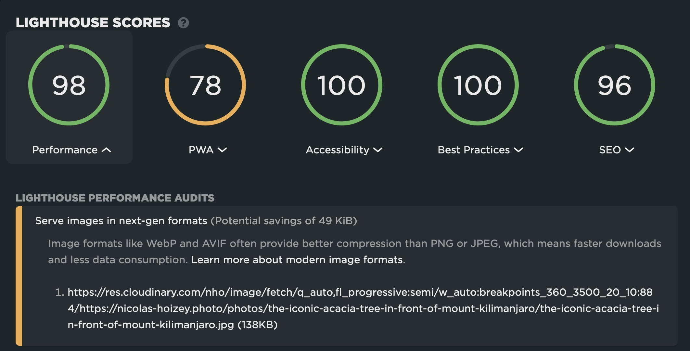

Should I please Lighthouse with modern image formats, or my visitors with progressive rendering of large images in [my photography site](https://nicolas-hoizey.photo)? 🤔

Of course, this would be much easier with genaralized JPEG XL support, both modern and allowing progressive… 🤷‍♂️
