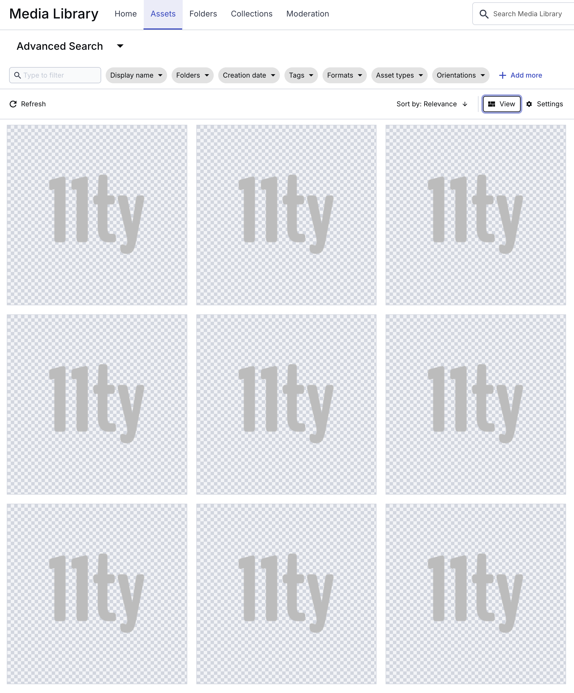

I'm not using #Eleventy's [screenshot service](https://www.11ty.dev/docs/services/screenshots/) for my [links]() content, thanks a lot @zachleat@zachleat.com!

But…

…it looks like many screenshots fail, so I get the default image — Eleventy's logo —, as you can see in my #Cloudinary Library… 😅